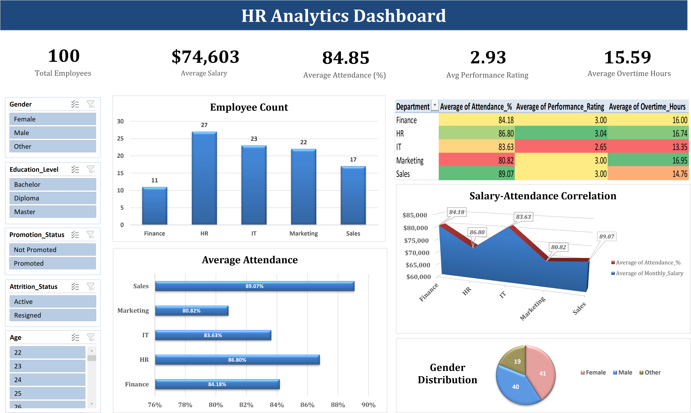

# HR Analytics Dashboard - Excel

> **IT pays the most but performs the least. Marketing is burning out. Overtime has near-zero effect on performance.**
> This dashboard was built to surface workforce problems that aggregate reports miss - and recommend actions HR can take immediately.

---

## The Bottom Line

Analyzing 100 employee records across 5 departments in Excel, this project uncovered three problems hiding in plain sight:

- **IT is overpaid relative to its output** - highest salary ($81,561) but lowest performance rating (2.65)
- **Marketing is showing textbook burnout signals** - highest overtime (~17 hrs) paired with the lowest attendance (80.82%)
- **Overtime has nearly zero effect on performance** - R² = 0.0106 across all 100 employees

Each finding includes a recommended action and a metric to track - because a dashboard that doesn't drive a decision isn't useful.

---

## Key Findings at a Glance

| Department | Avg Salary | Avg Performance | Avg Attendance | Avg Overtime |
|------------|-----------|-----------------|----------------|--------------|
| IT | $81,561 | 2.65 ⚠️ | 83.63% | 13.35 hrs |
| Finance | $80,287 | 3.00 | 84.18% | 16.00 hrs |
| HR | $72,310 | 3.04 ✅ | 86.80% | 16.74 hrs |
| Sales | $71,225 | 3.00 | 89.07% ✅ | 14.76 hrs |
| Marketing | $69,912 | 3.00 | 80.82% ⚠️ | 16.95 hrs ⚠️ |

---

## Project Overview

This project builds an interactive Excel dashboard to answer four specific questions an HR manager would actually ask:

1. Which department is overpaying relative to its performance output?
2. Where is burnout risk highest - and what does the data look like before someone quits?
3. Does working more overtime actually improve performance?
4. Which high-performing teams are quietly underpaid and at risk of leaving?

---

## Dataset

100 employee records across 5 departments - HR, IT, Marketing, Sales, and Finance.

**Fields included:**
- Employee ID, Gender, Age, Department, Education Level
- Monthly Salary, Attendance %, Overtime Hours
- Performance Rating, Promotion Status, Attrition Status

The dataset is intentionally compact - 100 records is small enough to understand completely, which makes it ideal for demonstrating that analytical thinking matters more than data volume.

---

## Tools Used

- **Microsoft Excel** - Power Query, Pivot Tables, Pivot Charts, Advanced Charts, IF functions, Conditional Formatting

---

## Methodology

### 1. Data Cleaning

All cleaning was done in Excel before any pivot tables or charts were built.

- **Checked for duplicates and missing values** - none found, but validated explicitly so the analysis could be trusted without caveats
- **Standardized salary and attendance formats** - ensured consistent numeric types so pivot table aggregations wouldn't silently error on text-formatted numbers
- **Created three derived analytical columns using IF functions:**
  - *Performance Evaluation* - classified each employee as High/Mid/Low performer based on rating, enabling segmentation beyond raw averages
  - *Most Leaves Taken* - flagged employees whose attendance fell below the departmental average
  - *Most Overtime Worked* - flagged employees exceeding average overtime hours, used in the scatter plot correlation analysis

### 2. Pivot Tables

Five pivot tables form the analytical foundation:

| # | Pivot Table | Key Finding |
|---|-------------|-------------|
| 1 | Employee Count by Department | HR: 27 (largest), Finance: 11 (smallest) - Finance delivers comparable performance at less than half the headcount |
| 2 | Department Efficiency Heatmap | IT lowest performance (2.65), Marketing highest overtime + lowest attendance simultaneously |
| 3 | Salary–Attendance Correlation | Finance and IT pay $80K+ yet attendance trails Sales ($71K, 89.07%) - pay ≠ engagement |
| 4 | Gender Distribution | 41F / 40M / 19 Other - balanced dataset means findings reflect structure, not demographics |
| 5 | Department Earnings | IT: $81,561 vs Marketing: $69,912 - $11,649 gap between highest and lowest paid |

### 3. Pivot Charts

Six pivot charts visualize the table summaries for the dashboard layer, connected to slicers so an HR manager can filter by department, gender, or performance tier and have all charts update simultaneously:

- Column chart - Employee Count
- Heatmap - Department Efficiency (color-coded: red = action needed, green = working)
- Bar chart - Average Attendance
- Area chart - Salary vs Attendance Correlation
- Pie chart - Gender Distribution
- Line chart - Monthly Salary by Department

### 4. Advanced Charts

**Department Efficiency Bubble Chart**
- X-axis: Avg Salary, Y-axis: Avg Performance Rating, Bubble size: Employee Count
- IT sits bottom-right - highest salary, lowest performance, isolated from every other department
- Finance sits just above at nearly the same salary but noticeably higher performance - best compensation ROI in the dataset
- A standard bar chart could show salary OR performance, not both at once. The bubble chart makes the IT anomaly impossible to miss.

**Overtime vs Performance Rating Scatter Plot**
- 100 individual data points plotted with overtime on X-axis and performance on Y-axis
- Trendline R² = 0.0106 - overtime explains just 1% of performance variation
- Employees working 0 hours and employees working 30 hours show virtually identical performance distributions
- Holds across all departments and all individuals - not a department-level trend

---

## Key Insights & Business Impact

### 1. IT: Highest Pay, Lowest Performance
**Problem:** $81,561 avg salary with a 2.65 performance rating - the worst pay-to-output ratio in the dataset.
**Action:** Conduct a skill-gap audit within 2 weeks. Launch a 90-day Performance Improvement Program for low-performers.
**Metric to track:** Salary-to-performance ratio by department (monthly).

### 2. Marketing: Active Burnout Signal
**Problem:** Highest overtime (~17 hrs) + lowest attendance (80.82%) = textbook pre-attrition pattern.
**Action:** Run a workload distribution audit. Introduce flex days or quarterly no-overtime weeks.
**Metric to track:** Overtime vs absenteeism correlation and monthly attrition within Marketing.

### 3. Sales: Loyal but Underpaid - Retention Risk
**Problem:** Highest attendance (89.07%) at only $71,225 avg salary - engaged but financially vulnerable to outside offers.
**Action:** Identify top 10% of sales performers, benchmark against market rates, design targeted retention package.
**Metric to track:** Voluntary attrition among top 20% sales performers.

### 4. Overtime Does Not Improve Performance
**Problem:** R² = 0.0106 - paying overtime without performance gain wastes payroll budget.
**Action:** Replace hours-based metrics with outcome-driven KPIs. Identify top 10 repetitive tasks driving overtime.
**Metric to track:** Overtime cost per unit of output.

### 5. HR: High Performance at Scale - Worth Replicating
**Finding:** Largest team (27) with highest performance rating (3.04) - HR's systems are working.
**Action:** Document HR's highest-impact processes and pilot them in IT - the highest-cost, lowest-performing department.
**Metric to track:** Performance rating delta in pilot department vs baseline over 90 days.

---

## How to Use

1. Download `HR_Analytics_Dashboard.xlsx`
2. Open in Microsoft Excel (2016 or later recommended)
3. Use the slicers on the dashboard to filter by Department, Gender, or Performance tier
4. All pivot charts update automatically based on slicer selection

---

## Connect

**Portfolio:** [surbhiparmar01.github.io](https://surbhiparmar01.github.io)
**LinkedIn:** [linkedin.com/in/surbhiparmar](https://www.linkedin.com/in/surbhiparmar/)
**GitHub:** [github.com/SurbhiParmar01](https://github.com/SurbhiParmar01)
